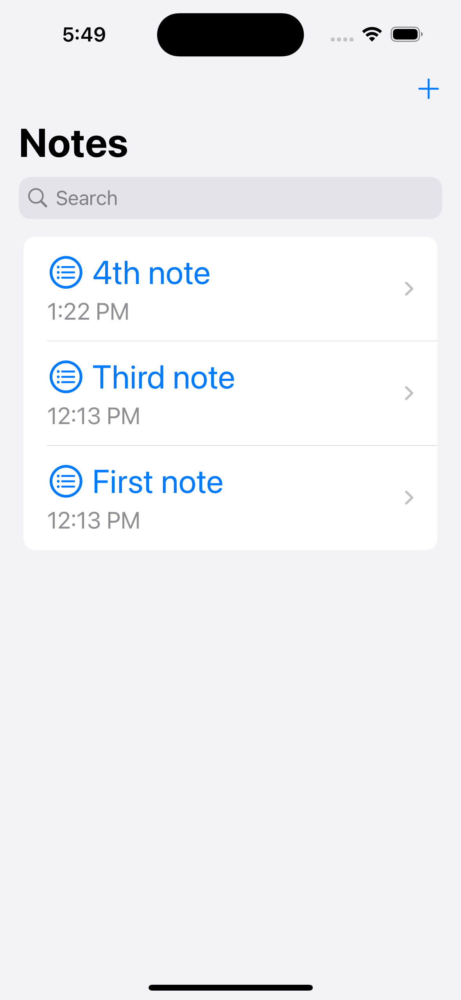
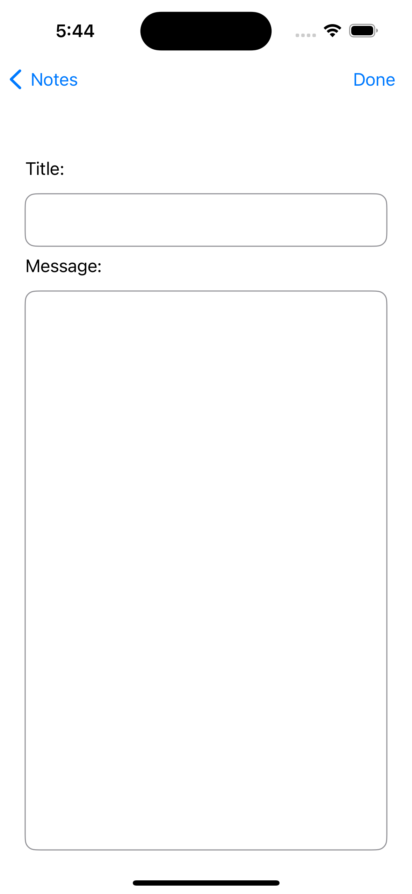
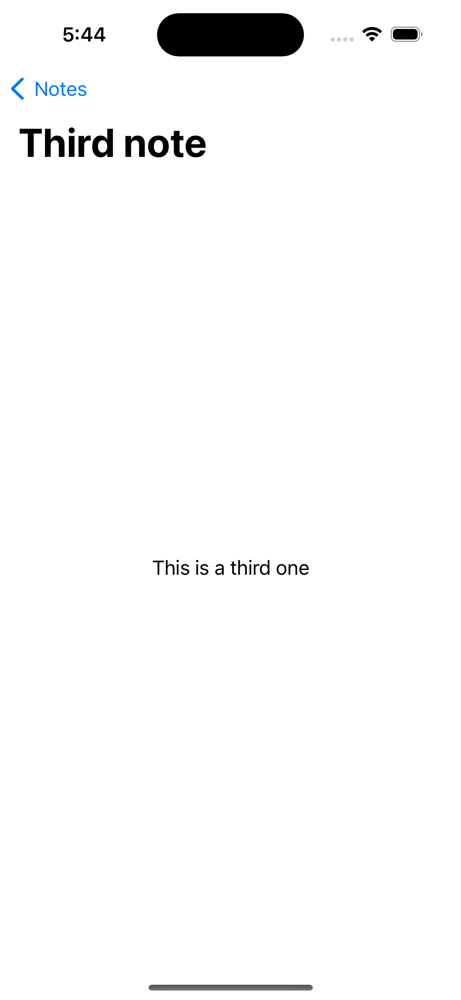
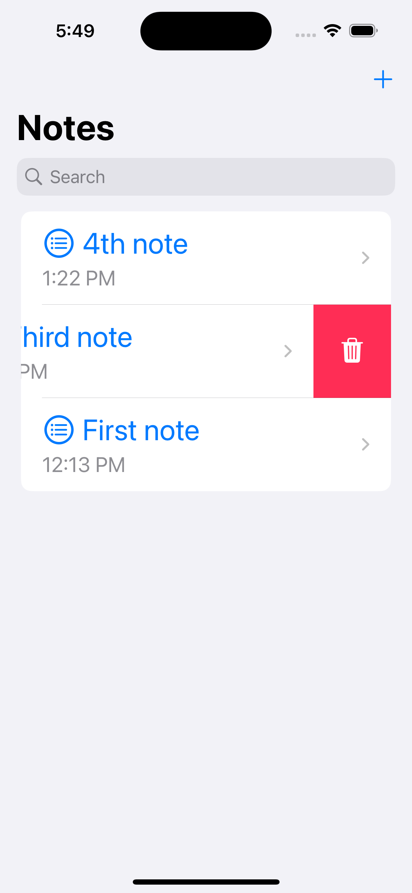
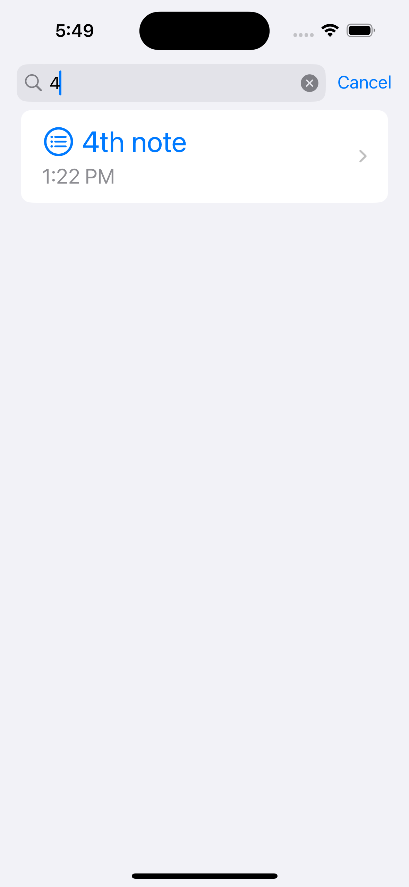

# NotesAppUsingCoreData
* Add, view and delete notes, or search for a note by its title.
* Implemented using CoreData to guarantee data persistence after closing the App.

## Using
* SwiftUI
* CoreData

## Screenshots
    
